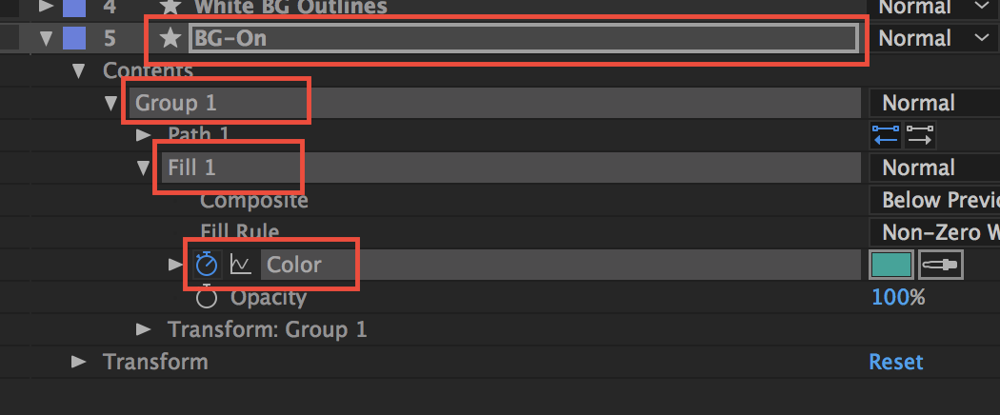

# lottie iOS集成方案

## 安装lottie（使用cocoapod安装）

#### `pod 'lottie-ios'`
#### `pod install`

集成完成

## 使用
### 普通动画

- 在需要使用的类中倒入头文件`#import <Lottie/Lottie.h>`
- 将准备好的动画json文件导入项目
- Lottie动画可以从捆绑的JSON或URL加载到捆绑JSON只需将它和动画所需的任何图像添加到xcode中的目标。

- ###usage

``` 
- (void)viewDidLoad {
 self.lottieLogo = [LOTAnimationView animationNamed:@"LottieLogo1_masked"];
    self.lottieLogo.contentMode = UIViewContentModeScaleAspectFill;
    CGRect lottieRect = CGRectMake(0, 120, self.view.bounds.size.width, self.view.bounds.size.height * 0.3);
    self.lottieLogo.frame = lottieRect;
    [self.view addSubview:self.lottieLogo];
 }
    
 - (void)touch:(UIButton *)sender {
    [self.lottieLogo play];
}

```

-  需要注意该方法会直接调用动画play，不需要手动执行后拿回调,动画结束后执行某些操作

```
LOTAnimationView * animation = [LOTAnimationView animationNamed：@“Lottie” ];
[ self.view addSubview:animation];
[animation playWithCompletion:^（BOOL animationFinished）{
   // Do Something 
}]; 
```

- bundle使用

```
LOTAnimationView * animation = [LOTAnimationView animationNamed：@“ Lottie ”  inBundle： [ NSBundle  YOUR_BUNDLE ]];
[ self .view addSubview： animation];
[animation playWithCompletion： ^（BOOL animationFinished）{
   // Do Something 
}];
```
- 从URL加载

```
LOTAnimationView * animation = [[LOTAnimationView alloc ] initWithContentsOfURL： [ NSURL  URLWithString： URL]];
[ self .view addSubview： animation];
```

- 交互式设置动画进度

```
CGPoint translation = [gesture getTranslationInView：self .view];
CGFloat progress = translation.y / self.view.bounds.size.height;
animationView.animationProgress = progress;
```

- 只播放动画的一部分：

```
[lottieAnimation playFromProgress:0.25  toProgress:0.5  withCompletion:^（BOOL animationFinished）{
   //做某事 
}];
```
### iOS视图控制器转换
- Lottie带有一个UIViewController动画控制器，用于制作自定义的viewController转换
- 从A控制器跳转到B控制器，只需要实现在A控制器实现lottle中UIViewControllerTransitioningDelegate代理，分别有两个代理，一个控制Present，一个控制dismiss
- 不支持导航栏跳转

```
- (id<UIViewControllerAnimatedTransitioning>)animationControllerForPresentedController:(UIViewController *)presented;
- (id<UIViewControllerAnimatedTransitioning>)animationControllerForDismissedController:(UIViewController *)dismissed;
```

### usage

```
- (void)touchNavPush:(UIButton *)sender {
    ViewController *vc = [[ViewController alloc]init];
    vc.transitioningDelegate = self;
    [self presentViewController:vc animated:YES completion:nil];
}

#pragma mark -- View Controller Transitioning

- (id<UIViewControllerAnimatedTransitioning>)animationControllerForPresentedController:(UIViewController *)presented
                                                                  presentingController:(UIViewController *)presenting
                                                                      sourceController:(UIViewController *)source {
    LOTAnimationTransitionController *animationController = [[LOTAnimationTransitionController alloc] initWithAnimationNamed:@"vcTransition1"
                                                                                                              fromLayerNamed:@"outLayer"
                                                                                                                toLayerNamed:@"inLayer"
                                                                                                     applyAnimationTransform:NO];
    return animationController;
}

- (id<UIViewControllerAnimatedTransitioning>)animationControllerForDismissedController:(UIViewController *)dismissed {
    LOTAnimationTransitionController *animationController = [[LOTAnimationTransitionController alloc] initWithAnimationNamed:@"vcTransition2"
                                                                                                              fromLayerNamed:@"outLayer"
                                                                                                                toLayerNamed:@"inLayer"
                                                                                                     applyAnimationTransform:NO];
    return animationController;
}

```
### Debugging - 调试

- Lottie有几个调试功能可以了解。 当加载动画时，不支持的功能将在控制台中以其功能名称打印输出。

- 如果你检查LOTHelpers.h，你会看到两个调试标志。 ENABLE_DEBUG_LOGGING和ENABLE_DEBUG_SHAPES。

- ENABLE_DEBUG_LOGGING增加了Lottie Logging的详细程度。 它在动画过程中随时记录动画节点。 如果您的动画不工作，请打开并播放动画。 控制台日志可能会给你一些关于发生了什么的线索。

- ENABLE_DEBUG_SHAPES为每个图层和形状的锚点绘制一个彩色方块。 这有助于查看屏幕上是否有任何内容。


### Adding Views to an Animation at Runtime -在运行时向动画添加视图
Lautie可以在运行时将自定义UI添加到LOTAnimation。 下面的例子显示了一些高级的用法来创建动态图像加载器。


- 上面的示例显示了使用加载旋转动画设置的单个LOTAnimationView。 加载旋转循环其动画的一部分，而此时图像被异步下载。 当下载完成后，将图像添加到动画中，其余的动画将无缝播放。 图像干净地动画化，完成块被调用。

- 如果说，动画已被设计师改变，需要更新。 所有这些都是更新捆绑包中的JSON文件。 不需要更改代码！

### Changing Animations At Runtime - 在运行时更改动画

Lottie可以做的不仅仅是播放美丽的动画。 Lottie允许您在运行时更改动画。

下面看一下例子，包含了四个开关。


下面看实现代码：

```
let animationView = LOTAnimationView(name: "toggle");
self.view.addSubview(animationView)
animationView.frame.origin.x = 40
animationView.frame.origin.y = 20
animationView.autoReverseAnimation = true
animationView.loopAnimation = true
animationView.play()

let animationView2 = LOTAnimationView(name: "toggle");
self.view.addSubview(animationView2)
animationView2.frame.origin.x = 40
animationView2.frame.origin.y = animationView.frame.maxY + 4
animationView2.autoReverseAnimation = true
animationView2.loopAnimation = true
animationView2.play()

let animationView3 = LOTAnimationView(name: "toggle");
self.view.addSubview(animationView3)
animationView3.frame.origin.x = 40
animationView3.frame.origin.y = animationView2.frame.maxY + 4
animationView3.autoReverseAnimation = true
animationView3.loopAnimation = true
animationView3.play()

let animationView4 = LOTAnimationView(name: "toggle");
self.view.addSubview(animationView4)
animationView4.frame.origin.x = 40
animationView4.frame.origin.y = animationView3.frame.maxY + 4
animationView4.autoReverseAnimation = true
animationView4.loopAnimation = true
animationView4.play()

```
下面接着更改开关的颜色


实现代码

```
animationView2.setValue(UIColor.green, forKeypath: "BG-On.Group 1.Fill 1.Color", atFrame: 0)
animationView3.setValue(UIColor.red, forKeypath: "BG-On.Group 1.Fill 1.Color", atFrame: 0)
animationView4.setValue(UIColor.orange, forKeypath: "BG-On.Group 1.Fill 1.Color", atFrame: 0)

[animationView2 setValue:[UIColor greenColor] forKeypath:@"BG-On.Group 1.Fill 1.Color" atFrame:@0];

```
 - keyPath是After Effects中图层和属性名称的点分隔路径。 LOTAnimationView提供- （void）logHierarchyKeypaths，它会递归地记录动画的所有可设置的关键字。

 
 
 - Lottie允许您更改After Effects中可动画的任何属性。 如果关键帧不存在，则为您创建一个线性关键帧。 如果关键帧确实存在，那么只是其数据被替换。
 
## Animated Controls and Switches - 动画控制和开关
 
 
- Lottie还拥有`UIControl`的自定义子类，用于创建自定义的动画交互式控件。 目前，Lottie拥有`LOTAnimatedSwitch`，它是一种切换式开关控制。 开关开关播放开启或关闭动画，并向所有目标发送`UIControlStateValueChanged`广播。 与使用`UISwitch`的方式相同，使用几个附加功能来设置Lottie的动画。

- 可以使用方便方法或直接提供动画来初始化开关。

```
// Convenience
LOTAnimatedSwitch *toggle1 = [LOTAnimatedSwitch switchNamed:@"Switch"];
 
// Manually 
LOTComposition *comp = [LOTComposition animationNamed:@"Switch"];
LOTAnimatedSwitch *toggle1 = [[LOTAnimatedSwitch alloc] initWithFrame:CGRectZero];
[toggle1 setAnimationComp:comp];

```
- 可以为开机和关闭动画指定动画时间轴的特定部分。 默认情况下，LOTAnimatedSwitch将向前开始播放动画，然后向后结束播放动画。

```
/// On animation is 0.5 to 1 progress.
[toggle1 setProgressRangeForOnState:0.5 toProgress:1];

/// Off animation is 0 to 0.5 progress.
[toggle1 setProgressRangeForOffState:0 toProgress:0.5];
```

- 此外，所有LOTAnimatedControls都增加了状态更改外观更改的支持。 这需要After Effects中的一些设置。 Lottie将根据控件状态切换可见的动画图层。 这可以用于具有Disabled，selected或Highlighted状态。 这些状态与After Effects中的图层名称相关联，并作为控件更改状态动态显示。

- 假设我们有一个具有Normal和Disable状态的开关。 在效果中，我们有一个组合包含常规“按钮”和禁用的“ Disable”状态的Precomps。 他们有不同的视觉风格

 
 
 现在在代码中，我们可以将UIControlState与这些层相关联。
 
 ```
 // Specify the layer names for different states
[statefulSwitch setLayerName:@"Button" forState:UIControlStateNormal];
[statefulSwitch setLayerName:@"Disabled" forState:UIControlStateDisabled];
// Changes visual appearance by switching animation layer to "Disabled"
statefulSwitch.enabled = NO;
// Changes visual appearance by switching animation layer to "Button"
statefulSwitch.enabled = YES;
```


## Supported After Effects Features - 支持After Effects功能

### 1. Keyframe Interpolation - 关键帧插值

- Linear Interpolation - 线性插值
- Bezier Interpolation - 贝塞尔插值
- Hold Interpolation - 保持插值
- Rove Across Time - 漫长的时间
- Spatial Bezier - 空间贝塞尔
### 2. Solids

- Transform Anchor Point - 改变锚点
- Transform Position - 转变位置
- Transform Scale - 改变尺寸
- Transform Rotation - 改变旋转
- Transform Opacity - 改变不透明度
### 3. Masks - 遮罩

- Path - 路径
- Opacity - 不透明度
- Multiple Masks (additive, subtractive and intersection) - 多重掩模（加法，减法和交叉）
### 4. Track Mattes

- Alpha Matte
### 5. Parenting

- Multiple Parenting
- Nulls
### 6. Shape Layers

- Anchor Point
- Position
- Scale
- Rotation
- Opacity
- Path
- Group Transforms (Anchor point, position, scale etc) - 组变换（锚点，位置，尺度等）
- Rectangle (All properties) - 矩形（所有属性）
- Eclipse (All properties) - 椭圆（所有属性）
- paths in one group - 一组中有多条路径
- Even-Odd winding paths - 基偶绕数路径
- Reverse Fill Rule - 反向填充规则
### 7. Stroke (shape layer)

- Stroke Color
- Stroke Opacity
- Stroke Width
- Line Cap
- Dashes (Now Animated!)
### 8. Fill (shape layer)

- Fill Color
- Fill Opacity
### 9. Trim Paths (shape layer)

- Trim Paths Start
- Trim Paths End
- Trim Paths Offset
### 10. Repeaters

- Supports repeater transforms
- Offset currently not supported
### 11. Gradients

- Support for Linear Gradients
- Support for Radial Gradients
### 12. Polystar and Polygon

- Supported! Theres a known bug if the roundness is greater than 100 percent
### 13. Layer Features

- Precomps
- Image Layers
- Shape Layers
- Null Layers
- Solid Layers
- Parenting Layers
- Alpha Matte Layers
### 14. Currently Unsupported After Effects Features

- Merge Shapes
- Alpha Inverted Masks
- Trim Shapes Individually feature of Trim Paths
- Expressions
- 3d Layer support
- Time remapping / Layer Reverse
- Layer Blend Modes
- Layer Effects