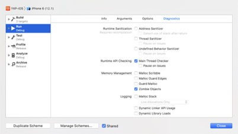

## 引用循环优化

### 两个基础概念
`内存溢出（out of memory）`：是指程序在申请内存时，没有足够的内存空间供其使用，出现out of memory。通俗理解就是内存不够，通常在运行大型软件或游戏时，软件或游戏所需要的内存远远超出了你主机内安装的内存所承受大小，就叫内存溢出。

`内存泄漏（ memory leak）`：是指程序在申请内存后，无法释放已申请的内存空间，一次内存泄漏危害可以忽略，但内存泄漏堆积后果很严重，无论多少内存,迟早会被占光。

### 循环引用
iOS内存中的分区有：堆、栈、静态区。其中，栈和静态区是操作系统自己管理回收，不会造成循环引用。在堆中的相互引用无法回收，有可能造成循环引用。

**循环引用的实质**：多个对象相互之间有强引用，不能施放让系统回收。

解决循环引用一般是将 strong 引用改为 weak 引用。

### 常用的内存泄漏排查方法
**静态分析方法（Analyze）**
- 1、通过Xcode打开项目，然后点击Product->Analyze，开始进入静态内存泄漏分析。
> 主要解决以下问题：
1) 逻辑错误：访问空指针或未初始化的变量等；
2) 内存管理错误：如内存泄漏等；
3) 声明错误：从未使用过的变量；
4) API调用错误：未包含使用的库和框架。


静态内存泄漏分析能发现大部分问题，但只是静态分析，并且并不准确，只是有可能发生内存泄漏。一些动态内存分配的情形并没有分析。

- 2、静待分析完毕，完成后点击箭头所在位置


- 3、点击左侧蓝色分箭头的位置，右侧会定位到对应的代码行并会给出相应的原因，可根据原因进行相应的修改


#### 静态分析结论

从静态分析结果可以看到，工程中大致存在四种类型的编译时的问题： 
- 1、内存错误：主要问题在于方法的返回类型和return语句的返回类型不一致
- 2、声明错误：主要问题在于声明的变量，没有使用的地方
- 3、潜在的内存问题：问题原因和2>相同
- 4、API调用错误：主要问题在于形参为非空，却传入了nil

### 动态分析方法（Instrument的leak）
分析内存泄漏不能把所有的内存泄漏查出来，有的内存泄漏是在运行时，用户操作时才产生的。那就需要用到Instruments了。

- 1、打开Instruments
方法1> 通过Xcode打开项目，然后点击Product->Profile

方法2> 通过Xcode打开项目，然后点击Xcode->Open Developer Tool->Instruments


- 2、选择Leaks，点击choose，之后选择要检测的程序，长按左上角小红点可以选择option或者直接点击小红点，然后开始记录

	

	


	> 需要注意选择了Enable NSZombie detection后，Leaks检测不可用


- 3、操作app，查看instruments。
其中红色叉代表有内存泄漏，横岗代表没有内存泄漏，可以使用鼠标过滤一部分泄漏区域单独分析


左下角箭头所在位置，可以选择泄漏，终端输出或冲突，一般我们选择泄漏就可以了
右下角箭头所在位置，选中后会隐藏堆栈中的系统调用


##### 可以看到选择leaks之后我们有三个选项可以查看
- 1、Leaks：以表格的形式查看到响应的内存情况，这个情况下我们关心的是Responsible Library和Responsible Frame
- 2、Cycle & Roots：以图的形式查看内存情况
- 3、Call Tree：可以查看内存使用和泄漏，这个情况我们关心的是Symbol Name以及Bytes Used


Call Tree形式下，我们可以看到底部出现的几个选项
我们选择CallTree，勾选InvertCallTree和HideSystemLibraries，这样可以隐藏系统库调用和反转调用树，能让我们更专注的关心工程的问题

#### Xcode自带的代码诊断工具-Diagnostics
打开Diagnostics

- 方法1、Xcode 的 Product->Sheme->Edit Scheme->Run->Diagnostics
- 方法2、Xcode左上角工程名字-》Edit Scheme->Run->Diagnostics

#### Diagnostics各个选项功能

**Runtime Sanitization**
需要重新编译

**Address Sanitizer**
原理是当程序创建变量分配一段内存时，将此内存后面的一段内存也冻结住，标识为中毒内存。当程序访问到中毒内存时（越界访问），就会抛出异常，并打印出相应log信息。主要用于定位野指针的bug

**Thread Sanitizer**
当两个线程并发访问同一个变量，并且至少有一个访问是写时，会发生数据竞争。Thread Sanitizer可以帮助识别这些问题，作为一个能够检查线程错误的工具, 它能检查错误的类型包括一下几种：
1）Use of uninitialized mutexes
2）Thread leaks (missing phread_johin)
3）Unsafe calls in signal handlers (ex:malloc)
4）Unlock from wrong thread
5）Data race
主要用于定位多线程造成的问题

**Undefined Behaviour Sanitizer**
可以帮助开发者在运行时找到一些异常情况，包括如下情况：
1）运行时的Bug查找：整型溢出；
2）检查C中的不安全的Constructs；
3）和其他运行时的工具可以兼容；

**Runtime API Checking**
Main Thread Checker：在app启动时，Main Thread Checker会用被调用方法implementation的一个替换版本动态的替换那些只应该在主线程调用的方法implementation。而这个方法的implementation的替换版本可以在调用之前预先检查出其是否在主线程上调用。简而言之就是，可以帮助开发者检查出那些应该在主线程调用但却在后台线程调用了的API。
pause on issues选中后，程序会停止在问题代码那一行，不再继续执行。
Xcode10.1默认是选中了这个选项的

#### Memory Management
**Malloc Scribble**
申请内存后在申请的内存上填0xAA，内存释放后在释放的内存上填0x55；再就是说如果内存未被初始化就被访问，或者释放后被访问，就会引发异常，这样就可以使问题尽快暴漏出来。Scribble其实是malloc库libsystem_malloc.dylib自身提供的调试方案。
Malloc Guard Edges：申请大片内存的时候在前后page上加保护，保护模式可自行Google。

**Guard Mallocs**
使用libgmalloc捕获常见的内存问题，比如越界、释放之后继续使用。由于libgmalloc在真机上不存在，因此这个功能只能在模拟器上使用。

**Zombie Objects**
Zombie的原理是用生成僵尸对象来替换dealloc的实现，当对象引用计数为0的时候，将需要dealloc的对象转化为僵尸对象。如果之后再给这个僵尸对象发消息，则抛出异常，并打印出相应的信息，调试者可以很轻松的找到异常发生位置。
分析内存泄漏，我们主要使用这个选项

#### Logging设置调试过程中，输出的日志包含的内容

- Malloc Stack：动态内存分配栈，记录分配内存和释放内存时相关栈的信息。
- Dynamic Linker API Usage：记录动态链接相关API的调用信息。
- Dynamic Library Loads：库加载信息，记录动态链接相关API的调用信息。这个主要是用于查找到问题时，查找具体的代码。此选项用处不大

### 内存泄漏的原因分析
#### 1、ViewController中存在NSTimer
如果你的ViewController中有NSTimer，那么你就要注意了，因为当你调用
```
[NSTimer scheduledTimerWithTimeInterval:1.0 
                                 target:self 
                               selector:@selector(updateTime:) 
                               userInfo:nil 
                                repeats:YES];

```
原因：这时target: self，增加了ViewController的retain count，即self强引用timer，timer强引用self。

解决方案：在恰当时机调用[timer invalidate]即可，或使用proxy代理方法实现。

#### 2、ViewController中的代理delegate

代理在一般情况下，需要使用weak修饰。如果你这个VC需要外部传某个delegate进来，通过delegate+protocol的方式传参数给其他对象，那么这个delegate一定不要强引用，尽量使用weak修饰，否则你的VC会持续持有这个delegate，直到代理自身被释放。

原因：如果代理用strong修饰，ViewController（self）会强引用View，View强引用delegate，delegate内部强引用ViewController（self）。

解决方案：代理尽量使用weak修饰

#### 3、ViewController中Block

在我们日常开发中，如果block使用不当，很容易导致内存泄漏。

原因：如果block被当前ViewController（self）持有，这时，如果block内部再持有ViewController（self），就会造成循环引用。

解决方案：在block外部对弱化self，再在block内部强化已经弱化的weakSelf

#### 4、Parent-Child相互持有

两个实例之间相互持有，最常见的是类中有一个属性，该属性是一个类的实例，这个实例又持有了本类，
还有就是cell的block中，使用了self

原因：两个实例相互持有，a持有b，b又持有a。

解决方案：声明类类型的属性时使用，其中一个使用weak修饰

#### 关于instruments
Xcode的Instruments很强大，但是使用起来也很麻烦，需要针对一个特定的情景，反复的测试，才有可能发现问题所在

根据苹果开发者文档，我们知道，app的内存大致分为三类
- 1、Leaked memory：不被app引用，既不能重复使用，也不能被释放的内存
- 2、Abandoned memory：被app一些无用的类引用的内存
- 3、Cached memory：被app引用，用于重用或提高性能的内存
> Leaked memory 和 Abandoned memory 都属于应该释放而没释放的内存，都是内存泄露，而 Leaks 工具只负责检测 Leaked memory，而不管 Abandoned memory，对于 Abandoned memory，可以用 Instrument 的 Allocations 检测出来

用这种方法来发现内存泄露还是很不方便的：
首先，你得打开 Allocations，其次，你得一个个场景去重复的操作无法及时得知泄露，得专门做一遍上述操作，十分繁琐

### 一些可用的内存检测工具（三方库）
#### PLeakSniffer

相关资料请查看：http://www.cocoachina.com/ios/20160706/16951.html
此工具使用swizzling实现，通过特定log给出泄漏提示，使用过程中干扰了工程中的部分功能，不建议使用

使用此工具发现的工程中有问题的类

```
Detect Possible Controller Leak: EvaluateViewController
Detect Possible Controller Leak: YXU_NewC2BSellCarProgressVC
Detect Possible Controller Leak: YXU_EaseMessageViewController
Detect Possible Controller Leak: YXU_MultCarCompareBaseVC
Detect Possible Controller Leak: YXU_MultCarCompareVC
Detect Possible Leak: YXU_CarFilterTopSearchView
Detect Possible Leak: YXURangeSliderCell
Detect Possible Leak: YXUTitleAndButtonsCell
Detect Possible Controller Leak: YXUQuestionAskVC
Detect Possible Leak: YXU_CarSelectView 
```

#### MLeaksFinder

相关资料请查看：
https://wereadteam.github.io/2016/02/22/MLeaksFinder/
http://wereadteam.github.io/2016/07/20/MLeaksFinder2/
此工具是腾讯开源的一款内存泄漏检测工具，当有内存泄漏发生时，退出页面会有alert弹框提醒

使用此工具发现的工程中有问题的类
```
YXUCarDetailDefectView                   
YXU_CarFilterTopSearchView  
YXU_NewC2BSellCarProgressVC	       
YXU_MyHalfPriceVC
EvaluateViewController	                   
YXU_DetectionDetailVC
YXU_MultCarCompareVC                   
DiscoveryWebVC
YXUCarListVC	                               
YXUMessageVC
YXUCarDetailVC2                              
YXUCarDetailFlawsCell 
```

### 优化方向参考图
最后套用一张网络上的优化方向的图片


**参考文章：**

【Xcode Diagnostic】

1、[http://www.sohu.com/a/285141940_216613](http://www.sohu.com/a/285141940_216613)

2、[https://www.cnblogs.com/wdsunny/p/7583260.html](https://www.cnblogs.com/wdsunny/p/7583260.html)

3、[https://www.cnblogs.com/oc-bowen/p/6109171.html](https://www.cnblogs.com/oc-bowen/p/6109171.html)

【Address Sanitizer使用】

1、[https://www.cnblogs.com/xitang/p/4904405.html](https://www.cnblogs.com/xitang/p/4904405.html)

【Thread Sanitizer使用】

1、[https://www.jianshu.com/p/a0ab1c8f6592](https://www.jianshu.com/p/a0ab1c8f6592)