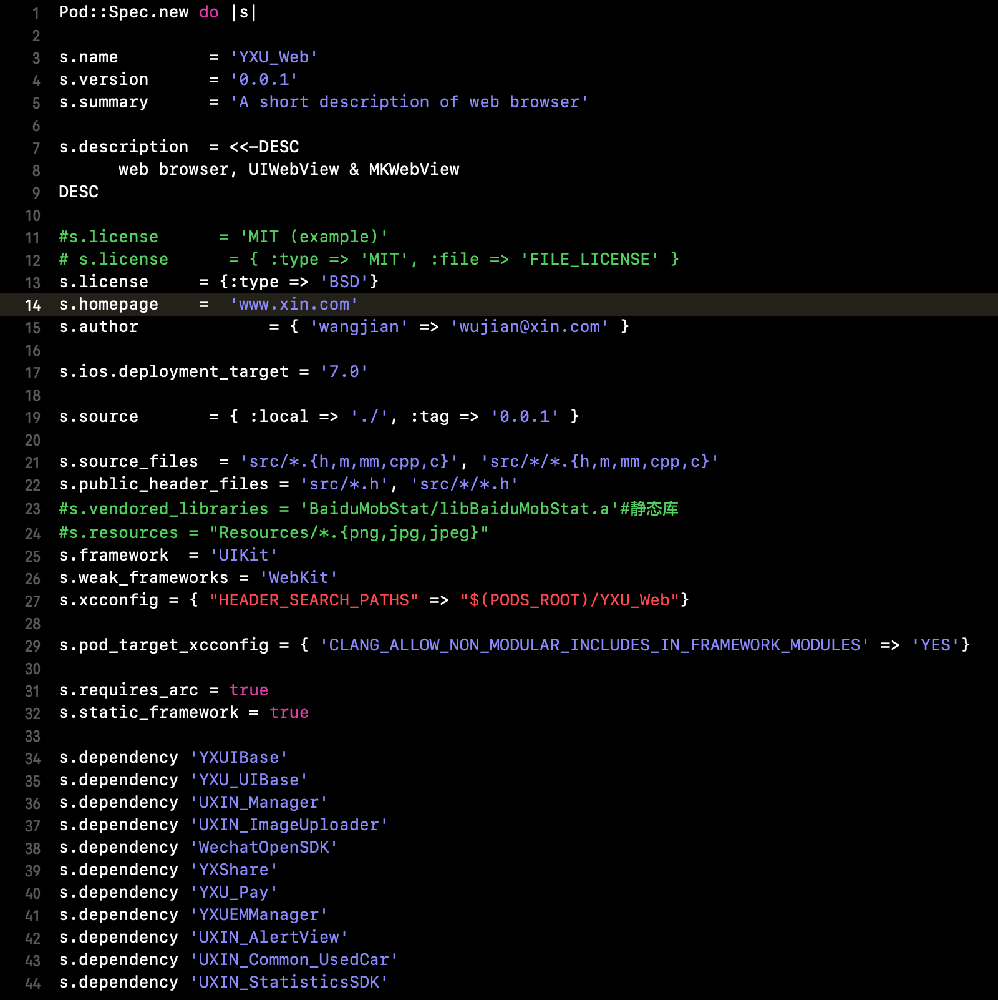
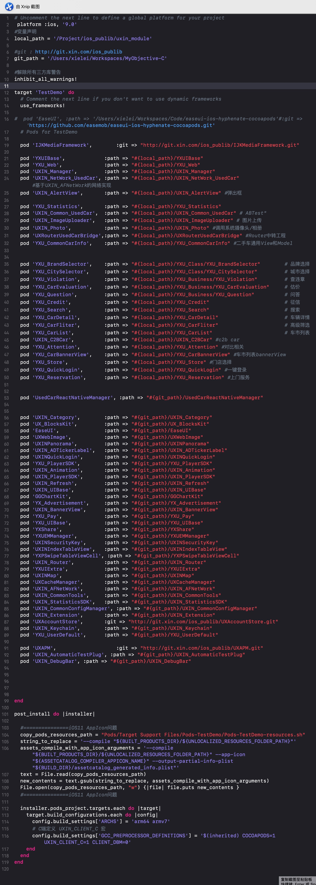

# 二手车项目pod版本升级分享

##### 1. CocoaPods 简介

CocoaPods工具的用处，将项目中需要依赖的代码通过workspace形式集成起来，供项目使用。

常见用法：

```
//安装cocoapods工具
gem install cocoapods

//更新pod索引
pod repo setup 

//初始化Podfile文件
pod init 

//安装/更新 依赖库
pod install/update 
```

略为高级用法：
```
//指定非官方源
source https://gitlab.xin.com/Specs.git
pod repo remove master & pod repo add master https...

//抑制警告
inhibit_all_warnings!
pod 'name', :inhibit_warnings => true 

//加快创建过程，跳过更新索引过程
--no-repo-update

//指定代码版本
pod 'name', :head
pod 'name', :git => ''
pod 'name', :git => '', branch => 'develop'
pod 'name', :git => '', tag => '10.0.0'
pod 'name', :git => '', commit => '0482555d673192681c246b78ccb0456d5e272b09'
pod 'name', :path => '/Project/ios_publib/uxin_module'

//指定环境
pod 'APM', :configurations => ['Debug']

//指定target
target 'test'  do
end

//指定xcodeproj
xcodeproj 'MyProject'
target :test do  
  # This Pods library links with a target in another project.
  xcodeproj 'TestProject'
end

```
cocoapods使用ruby编写，可以运行脚本工具。

##### 2. CocoaPods 版本特性

[Cocoapods Release内容查阅](https://github.com/CocoaPods/CocoaPods/releases)
  

- **关键字：swift、xcode version、Dynamic Library、CocoaPods、use_frameworks!、static_framework**

swift发布后的一段时间内，不支持静态库，配合Cocoapods，声明 use_frameworks! 变量

动态库加载机制，数量限制，crash增加

xcode9后，支持 Swift Static Library ，Cocoapods 1.4 版本支持纯Swift项目静态库，

在 1.5 版本后完美支持Objective-C和Swift混编，在podspec文件内显示指定 s.static_framework = true

PS：子项目过多可以通过脚本
```
module Pod
  class PodTarget
    def static_framework?
      return true
    end
  end
end
```

- **Cocoapods 1.6、稳定性**


版本发布时间
```
2018-08-16: 1.6.0.beta.1
2018-10-17: 1.6.0.beta.2
2019-01-25: 1.6.0.rc.1
2019-01-29: 1.6.0.rc.2
2019-02-07: 1.6.0
2019-02-22: 1.6.1
```
CocoaPods 1.6.0 版本的更新主要集中在**针对大型工程的稳定性、性能和可扩展性方面**。

**完全重写**了 Build Settings（位于 CocoaPods 生成的 .xcconfig 文件中）的生成过程。

这次重写的主要目的是清理旧的代码，并使其在大型工程上可以更好地扩展。


- **Cocoapods 1.7、多 Swift 版本支持、生成多个 Xcodeproj、增量安装、对 Master Specs Repo 提供 CDN 支持**

版本发布时间
```
1.7.0.beta.1 (2019-02-22)
1.7.0.beta.2 (2019-03-08)
1.7.0.beta.3 (2019-03-28)
1.7.0.rc.1 (2019-05-02) 
1.7.0.rc.2 (2019-05-16)
1.7.0 (2019-05-23)
1.7.1 (2019-05-31)
1.7.2 (2019-06-14)
1.7.3 (2019-06-29)
1.7.4 (2019-07-08)
1.7.5 (2019-07-17)
1.8.0.beta.1 (3 days ago)
```

多swift版本支持 -> 疲于升级swift API 变动 -> swift ABI 稳定
```
//podspec
Pod::Spec.new do |spec|
  spec.name = 'UXIN_**'
  spec.version = '1.0'
  spec.swift_versions = ['3.2', '4.0', '4.2']
end

//podfile
supports_swift_versions '>= 3.0', '< 4.0'
```

生成多個 Xcodeproj -> 提升性能

在之前版本，workspace下只有一个Pods.xcodeproj，包含所有target和build settings。xcodeproj文件越大，xcode解析时间越长。每个pod集成到自己的Xcode Project，并嵌套在顶级Pods.xcodeproj下，可以显著提升大型项目的性能。

PS：头文件声明形式 "" 弃用，只能使用 <>

Podfile开启功能
```
install! 'cocoapods', :generate_multiple_pod_projects => true
```

增量安装 -> 节省时间

执行 pod install 后，仅重新生成上次 install 以来发生更改的 pod 库，不需要重新生成workspace 文件

Podfile开启，PS：incremental_installation 需要开启 generate_multiple_pod_projects

```
install! 'cocoapods',
         :generate_multiple_pod_projects => true,
         :incremental_installation => true
```

为 Master Repo Specs 提供 CDN 支持

在 1.7.0 中，我们正在启动 CDN 支持，以避免在本地机器或 CI 系统上克隆 master specs repo，让使用 CocoaPods 更加方便。这可以通过将 Podfile 中声明的 master specs repo 的source 替换为如下内容来实现：

```
# source 'https://github.com/CocoaPods/Specs.git' comment or remove this line.
# source 'https://cdn.jsdelivr.net/cocoa/'
source 'https://cdn.cocoapods.org/'
#source 'http://git.xin.com/ios_publib/cocoapods-.git'
PS：如果失败，直接使用 cd ~/.cocoapods/repo & git clone http://git.xin.com/ios_publib/cocoapods-.git

```


PS：CDN、Content Deliver Network，内容分发网络；CDN加速，静态资源，网络节点缓存


##### 3. 二手车项目的Pod升级

1. 现状：

CocoaPods 个人倾向跟随版本更新，类似三方库固定版本还是跟随版本

苹果 WWDC 2019 宣布 Objecive-C 语言后期不再维护

越来越多的知名三方库不再维护 Objective-C 版本，相继推出 Swift 版本

项目如果后期 Swift/OC 混编，CocoaPods 必须升级

2. 过程：

尝试在项目中硬切Pod版本，改动量太大；

尝试过动态库方案，纯代码pod无缝切换，静态库依赖像高德、友盟都上传了动态库 podspec 文件，参照其他项目（即刻方案）后，放弃；

分布升级，创建空项目，优先整理私有库pod。
目测二手车Podfile文件，猜测哪个依赖库较少，从哪个进行入手，参看 usedcarpodcheck -> PodSourceFile。

整理pod过程中遇到的几类问题：

podspec文件写法不正确EASEUI

重新封装三方库变成私有库，修改了或者没有修改代码 SSZipArchive

头文件声明格式错误 `<*.h> "*.h" <modulename/*.h>`

define.h 文件引入的类文件过重，引入其他私有库文件，供自己内部和外部同时使用

引入了其他库头文件，没有添加相应的 dependency

私有库之间存在了互相依赖，拆分、合并、废弃 
`a circular dependency between YXU_CarDetail and YXU_Shop`

RN相关，类似同上，引入 react-native-fix-cocoapods 插件，后废弃，所有人操作变复杂了，后面rn代码修改采用双向同步，参看 Project/node_modules/cocoapods-fix-react-native/0_56_1-post

显示声明 staic_framework = true

部分 pod 加入 pod_target_xcconfig 变量


<!--
-->

整理完毕后，共68个私有库，废弃3个

私有库pod全部整理完毕后，整合到二手车工程中就没有太大问题了，工程与 pod 之间只存在单项饮用，全部都是缺少头文件问题。

期间过程较长，所有pod和项目创建develop分支，随时进行本地代码的合并，后面开发全部在develop分支，发版后合并master分支。


<!--
-->

##### 4. pod升级之外的产物，usedcarpodcheck

demo展示环节 [gitlab](http://git.xin.com/ios_publib/usedcarpodcheck "gitlab")