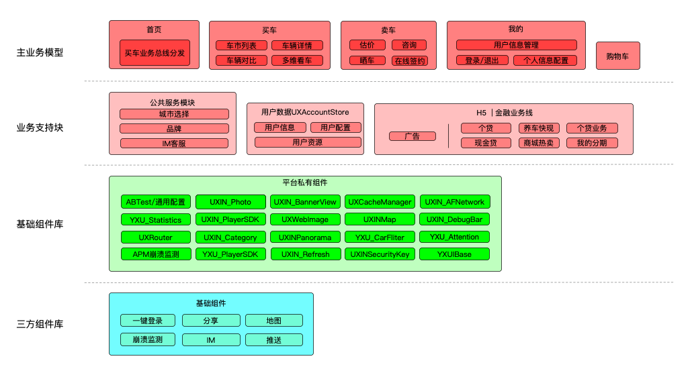
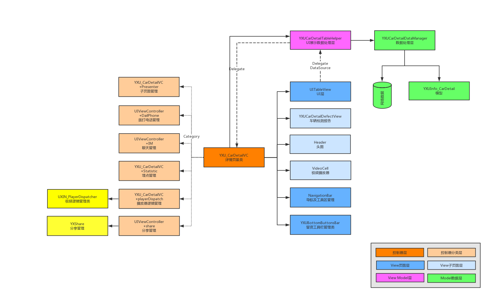
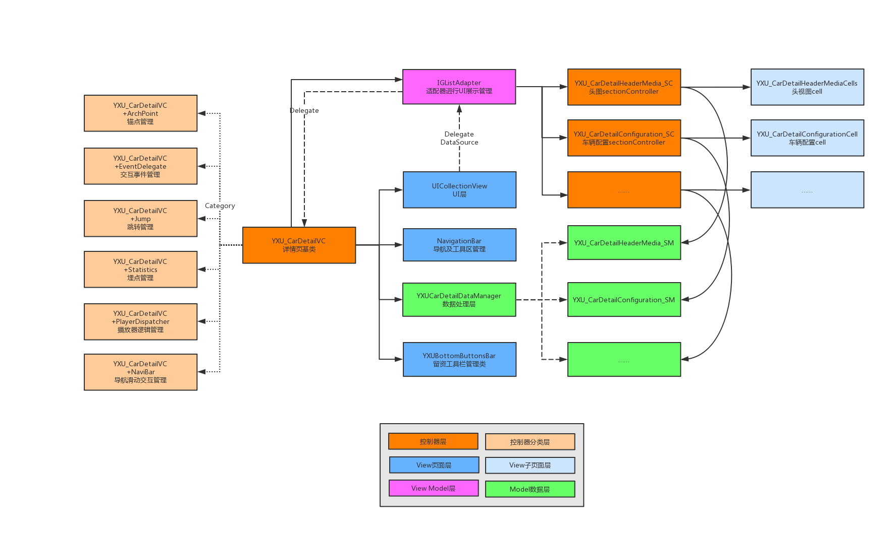

## 一、原由

随着二手车十个大版本上百个小版本的迭代，项目代码数量快速增长，编译效率，代码质量相对较低， 为了使我们项目模块使用更加轻便明晰，达到高内聚低耦合的目的，提高开发效率以及提升代码质量，我们根据现有架构，代码逻辑，整合出以下改造方案。

## 二、复杂度介绍

结合公司相关iOS项目，我们总结了一套通用的适用于相关项目的复杂度方案，
在梳理架构复杂度时，我们进行了如下分类

根据上面的图示，我们根据自己的实际情况梳理如下表格：

## 三、项目现状

## 3.1 整体项目分层

### 3.1.1各层定义简述：

* 业务模型
 * 二手车项目内部独立的业务模块
 * 当前模块之间有强耦合
 * 二手车项目独立业务无法对外部暴露
 * 业务线重点是买车业务线、卖车业务线、个人中心
* 业务支持
 * 相对独立，与其他模块之间弱耦合
 * 可以单独维护，可对其他项目组提供业务支持
 * 公共服务模块（品牌、城市选择和IM客服）支持业务模型，如买车、卖车
 * 用户数据，对个人中心进行业务支持
 * H5、金融业务线，独立于二手车业务
* 基础组件库
 * 独立封装、独立维护，面向独立业务，面向公司所有项目组
 * 主要提供基础、通用的代码功能，根据使用场景，进行功能封装，减少重复工作量
 * 封装单一功能，例如网络、视频、图片请求等
 * 提供工具属性业务逻辑封装，例如埋点统计，VR，图片浏览器等
 * 提供针对于App的支持，例如APM崩溃监测，路由Router，数据存储等
* 三方组件库
 * 包含项目内第三方SDK
 * 提供分享、一键登录、IM等独立功能
 * 对接口进行二次封装，方便实时替换，例如IM和地图。

### 3.1.2 当前各层调用关系
* 基础组件库和三方组件库对其他各层完全独立，各自模块之间解耦
* 业务支持，调用基础组件库和三方组件库，各模块之间解耦
* 业务模型向下调用，会引用业务支持、基础组件化和三方组件库代码，模块之间耦合严重

## 3.2 页面逻辑及代码结构

### 3.2.1  目前现状

如3.1架构图所示，当前业务支持、基础组件库、三方组件库已经实现内部模块解耦。
业务模型之间的耦合严重。表现如下:

1. 继承关系复杂
2. 单例模式使用混乱
3. 头文件引入混乱
4. 宏重复定义
5. 单模块内框架不统一

例上图详情页模块：

详情页模块是二手车App项目中重要的模块之一，业务逻辑复杂，版本迭代频繁。详情页代码存在的问题，可以用来代表项目中模块存在的问题。

 * 同一业务实现拆到了两个不同的类当中，造成了维护成本的增加。
 * 使用了不标准的MVVM模型，类之间的持有关系混乱
 * 头文件中暴露过多属性，模块初始化需要其他模块传入过多数据
 * 模块中引入了大量无用头文件

## 3.3 组件通信
目前"二手车"项目由于多次迭代改造原因，组件间通信库有三个：Lolita、Mediator、Router，现在是三足鼎立的形式。

- 1.Lolita是二手车最早使用的中间件，以vc分类方式编写，与vc绑定，其涵盖了路由的基本功能。在前期开发中使用也比较便利，解决了页面跳转耦合问题。但Lolita的路由功能只被定义在了页面跳转层面，在页面不跳转或非vc类通信时无法利用。而且Lolita是基于原生层面设计的，在接入RN后无法实现跨平台调用。随着Hybrid开发模式的深入，Lolita自身限制越发明显。后续开发了Mediator和Router，期望能逐步代替Lolita。

- 2.Mediator是基于Target-Action模式设计的中间件，它为每个组件创建一个Mediator分类，分类会暴露组件接口，调用方只需引入分类，从而达到解耦的目的。与Router相比，它更接近于原生方法的调用，但是它不具备Router的跨平台能力。

- 3.Router框架是伴随RN一起开发的，主要解决组件间通信、跨平台通信问题。Router不耦合任何原生类，不受依赖限制，是一个纯粹的路由容器，和Mediator是同步开发的。在原生项目改造过程中，组件通信并没有使用Router，而是用的Mediator。

## 四、 项目改造

1. 面向平面化开发，避免多层继承
2. 项目内业务简单模块使用MVC，复杂模块使用MVVM
3. 通用控件和Util方法抽离为单个组件库
4. 头文件导入和宏定义规范化
5. 代码规范统一
6. 内网环境做代码依赖管理

### 4.1 模块内优化

### 4.1.1 目的

1. 更好的人员协作、更好的功能模块划分
2. 解决项目模块间的代码耦合问题
3. 快速进行版本切换
4. 方便独立模块的单元测试
5. 提升各个项目组的工作效率，快速搭建和维护项目

### 4.1.2 方案
项目改造方案中，第一到第二步主要是单个模块的优化方案。依据业务模块的重要程度，会依次由高到底分版本和阶段操作。
继续以详情页为例：
由于业务迭代和研发任务，需要保证模块的稳定性，无法一次性完成优化。

<b>前期优化：</b>
)
在前期优化中

* 理清类和类的关系，减少相互持有
* 同步抽离通用控件和Util方法
* 模块间通信使用路由，减少单例的使用和对其他模块头文件的引入
* 减少头文件对外暴露的属性

<b>中期优化：</b>

优化的最终结果如上图：

* 去除多余的继承关系
* 抽离子组件
* 使用MVVM模型(未使用KVO机制)

<b>后期优化：</b>

优化的最终结果如上图：

* 集成IGListKit框架
* 所有子section/item拆分独立的逻辑
* KVO监听数据流变化，数据驱动UI刷新
* 每个独立的section/item可以独立开发，单元测试

### 4.3 结构层次优化

项目改造方案中，第三到第四步，会在单独时间内统一进行，目的是为了将通用的组件和Util方法进一步下沉。减少代码耦合和维护成本。

### 4.4 统一代码规范
代码规范，见附件：
代码规范的统一，会贯穿在我们日常的开发中。新的研发任务中，会要求并监督大家使用该规范。原有的代码，会随着模块内优化按时间点逐步修改。

### 4.5 内网环境实时抓取
内网环境做实时抓取，是为了保证在外网环境出现变化时，不影响我们Pod库的使用，提升我们代码编译速度，优先级较低。

### 4.6 组件间通信的后期发展

经过讨论，基建组决定进行Router2.0版本的升级改造。

具体有以下几个方面：

- 1.扩展Router功能，实现url与类名的映射，使用url或类名完成通信，方便业务开发。
- 2.实现路由的动态下发，app从服务器获取路由表，动态控制url的跳转。
- 3.限制页面的访问权限，防止外部恶意调用。
- 4.增加url参数校验，对无效参数进行过滤。
- 5.制定详细的url规则，有效区分不同平台、不同业务、不同操作。
- 6.将Mediator的部分功能合并到Router中，弃用Mediator。最后用改造完善的Router替换掉Lolita。

## 五、 项目预期

应用最终为层级结构，层次逐级向下，越往下层耦合越低，上层对下层有调用和修改的权限，相反不适用，保证层级清晰。层级划分尽可能的对业务代码进行抽离，抽离更多的基础组件，做到公共代码尽可能的下沉。

业务模块形成统一的开发模式。工程采用代码模版的形式，快速实现MVVM设计模式。应用整体代码编写形成规范，提升问题的查找定位和非本人负责的业务对接的效率。

平面化、面向切面（AOP）的开发模式逐步替换现有的多层继承开发模式，将父类的每个业务和功能进行拆分，最终使得应用的组件化更进一步。

组件化拆分配合Router2.0的开发 - 可以解决模块之间的严重耦合性，从模块之间的网状结构转变成模块与Router的单向调用。

当组件一个个独立开来，对同级模块不产生过多的依赖。在后面的开发中可以不依附于整个应用进行编码工作，实现更多单一模块的开发，调试，测试工作，大大减少因项目文件过多，依赖库复杂造成的编译时间过长，效率低下等问题。